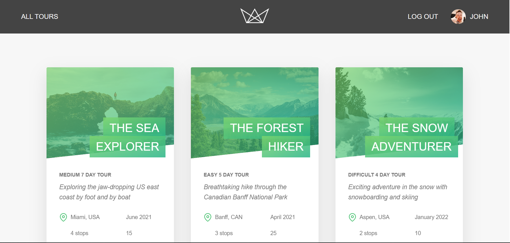

# Natours 🌍 – Tour Booking Web Application

A modern, full-featured **Node.js** application for booking adventurous tours, built with a clean architecture and powerful tools.


*Homepage interface*

---

## 🚀 Tech Stack

| Category      | Technology                                                                                                                                 |
|---------------|---------------------------------------------------------------------------------------------------------------------------------------------|
| 🌐 Frontend   |    |
| 🧠 Backend    |   |
| 🗃 Database   |                                              |
| 🔐 Auth       |                                               |
| 💳 Payments   |                                                |

---

## ✨ Features

- Secure **user authentication** with role-based access: `user`, `guide`, `lead-guide`, `admin`
- Stripe-powered **payment system**
- CRUD operations for tours, reviews, users (admin only)
- User profile management with photo upload
- Admin dashboard and user-friendly UI
- Filtering and sorting of tours by difficulty, duration, group size

---

## 📁 Project Structure

natours/
│
├── controllers/ # Business logic
├── models/ # Mongoose schemas
├── public/ # Static assets (CSS, JS, images)
├── routes/ # Express routers
├── utils/ # Utility functions
├── views/ # Pug templates
├── app.js # App configuration
├── server.js # Entry point
├── package.json # NPM dependencies
├── .env.example # Environment config
└── README.md # Project README


---

## 🔐 Environment Configuration

Create a `.env` file based on the following:

```env
NODE_ENV=development
PORT=3000

DATABASE=mongodb+srv://<USERNAME>:<PASSWORD>@cluster0.mongodb.net/natours
DATABASE_PASSWORD=your_password
DATABASE_LOCAL=mongodb://localhost:27017/natours

JWT_SECRET=your_jwt_secret
JWT_EXPIRES_IN=90d
JWT_COOKIE_EXPIRES_IN=90

EMAIL_USERNAME=your_mailtrap_username
EMAIL_PASSWORD=your_mailtrap_password
EMAIL_HOST=sandbox.smtp.mailtrap.io
EMAIL_PORT=2525
EMAIL_FROM=johnayodejie@gmail.com

SENDGRID_USERNAME=apikey
SENDGRID_API_KEY=your_sendgrid_api_key

STRIPE_SECRET_KEY=your_stripe_secret_key


▶️ Getting Started
1. Clone and Install

git clone https://github.com/john-ayodeji/natours.git
cd natours
npm install

2. Setup Environment
Create a .env file as shown above.

3. Run the App
Development:
npm run dev
Production:
npm run prod


Secure and responsive Stripe integration

🙌 Acknowledgements
Built as part of the Node.js Bootcamp by Jonas Schmedtmann.
Thanks to Jonas for the in-depth course and project structure!

📬 Contact
📧 Email: johnayodejie@gmail.com
🔗 GitHub: john-ayodeji
